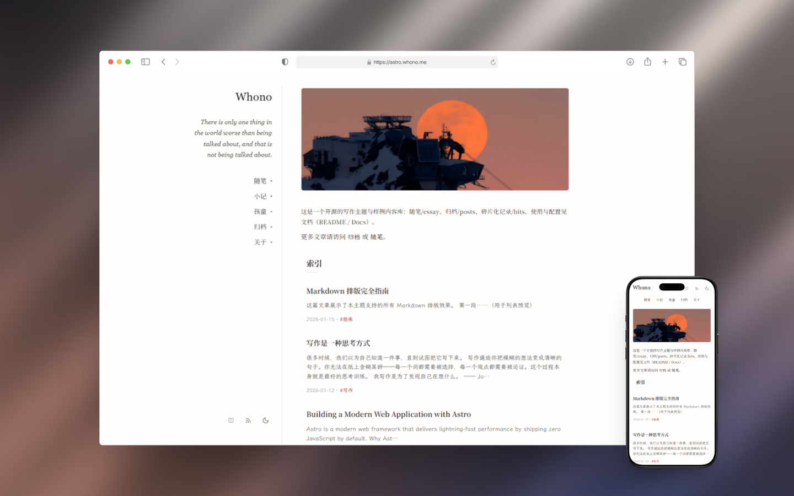
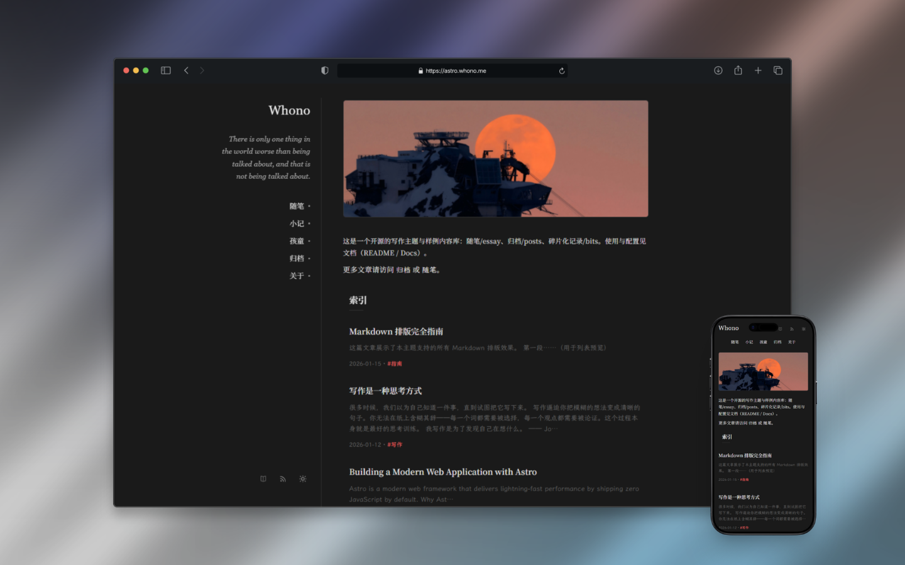

# astro-whono

[](https://github.com/cxro/astro-whono/actions/workflows/ci.yml)  [](https://github.com/cxro/astro-whono#%E7%8E%AF%E5%A2%83%E8%A6%81%E6%B1%82)  [](https://docs.astro.build/)  [](LICENSE)

一个极简双栏的 Astro 主题，用于个人写作与轻量内容发布。


## 预览

<p align="center">
  
  
</p>


## 特性

- 双栏布局（侧栏导航 + 内容区）
- 移动端适配
- 内容集合：posts / essay / bits / kids
- RSS：聚合 + 分栏订阅
- 浅色 / 深色模式 + 阅读模式


## 环境要求

- Node.js 22.12+（建议使用 `.nvmrc`）


## 快速开始

```bash
npm i
npm run dev
npm run build && npm run preview
```

<details>
  <summary>Windows（PowerShell）提示</summary>

如遇执行策略拦截 `npm.ps1`，可用：

- `cmd /c npm run ...`
- 或改用 Git Bash / WSL
</details>


## 一键部署

[](https://vercel.com/new/clone?repository-url=https://github.com/cxro/astro-whono) [](https://app.netlify.com/start/deploy?repository=https://github.com/cxro/astro-whono) <a href="https://dash.cloudflare.com/?to=/:account/workers-and-pages"></a>

部署参数（手动导入仓库时填写）：
- Framework preset：Astro（Cloudflare Pages）
- Build command：`npm run build`
- Output directory：`dist`
- Node version：`22.22`
- 环境变量（建议）：`SITE_URL=https://<你的域名>`
- 不设置 `SITE_URL` 也能部署，但 RSS/OG/canonical 可能使用相对链接或占位域名（`example.invalid`）
- 生产环境建议配置 `SITE_URL`，用于生成 canonical/og:url（绝对 URL）和 RSS 链接

<details>
<summary><strong>部署后检查</strong></summary>

- 首页 / 列表 / 详情页可访问
- RSS 可访问（`/rss.xml` 及分栏 RSS）
- 设置 `SITE_URL` 后：canonical / `og:url` 指向你的域名
- Network 不再请求演示域名资源

</details>


## 项目入口

- 站点配置：`site.config.mjs`
- 内容集合：`src/content.config.ts`
- 样式入口：`src/styles/global.css`


## 内容与路由

内容集合（Content Collections）：
- posts：位于 `src/content/posts` 目录
- essay：位于 `src/content/essay` 目录
- bits：位于 `src/content/bits` 目录
- kids：位于 `src/content/kids/index.md`

主要路由：
- 列表页：`/archive/`、`/essay/`、`/bits/`、`/kids/`、`/about/`
- 详情页：posts / essay 使用 `[...slug]`


## 核心字段（Frontmatter）

posts / essay：
```yaml
title: My Post
date: 2026-01-01
draft: false
archive: true
slug: optional
badge: optional # 仅 essay 使用
```

bits：
```yaml
date: 2026-01-01T12:00:00+08:00
draft: true
```

`draft: true` 的内容会从列表与 RSS 中过滤。


## 摘要与描述（description）

- 列表摘要默认从正文生成（清洗后截断）
- 可用 `<!-- more -->` 指定摘要截取位置
- `description` 仅用于 SEO/OG（meta description），不影响列表摘要


## 写作约定（内容块）

- Callout：`:::note[title] ... :::`（note / tip / info / warning）
- Figure：`figure > (img|picture) + figcaption?`
- Gallery：`ul.gallery > li > figure > (img|picture) + figcaption?`（可选 cols-2/cols-3）
- Quote：标准 `blockquote`，可选 `cite` 标注来源
- Pullquote：`blockquote.pullquote`
- Code Block：构建时增强工具栏/复制按钮/行号（作者无需额外写法）


## 字体与许可

本主题使用两套字体排版（自托管 + 子集化）：
- Noto Serif SC（400 / 600）
- LXGW WenKai Lite（Regular）

仓库提交的是子集化后的 WOFF2 字体（latin / cjk-common / cjk-ext 三段，`unicode-range` 按需加载），因此 **clone 即用**。
子集字符集由仓库文本 + `tools/charset-base.txt`（3500 常用字）共同生成，用来降低缺字概率。

重新生成字体子集：
1. 准备源字体放入 `tools/fonts-src/`
2. 运行 `npm run font:build`
3. 若出现缺字，将缺失字符补到 `tools/charset-common.txt` 后重跑

<details>
  <summary>字体文件清单（子集 + 源字体）</summary>

子集文件（仓库内）：
- `public/fonts/lxgw-wenkai-lite-latin.woff2`
- `public/fonts/lxgw-wenkai-lite-cjk-common.woff2`
- `public/fonts/lxgw-wenkai-lite-cjk-ext.woff2`
- `public/fonts/noto-serif-sc-400-latin.woff2`
- `public/fonts/noto-serif-sc-400-cjk-common.woff2`
- `public/fonts/noto-serif-sc-400-cjk-ext.woff2`
- `public/fonts/noto-serif-sc-600-latin.woff2`
- `public/fonts/noto-serif-sc-600-cjk-common.woff2`
- `public/fonts/noto-serif-sc-600-cjk-ext.woff2`

源字体（不入库）：
- `tools/fonts-src/LXGWWenKaiLite-Regular.woff2`
- `tools/fonts-src/NotoSerifSC-Regular.ttf`
- `tools/fonts-src/NotoSerifSC-SemiBold.ttf`
</details>

字体许可：SIL Open Font License 1.1（见 `public/fonts/OFL-LXGW-WenKai-Lite.txt` 与 `public/fonts/OFL-NotoSerifSC.txt`）。


## RSS

- `/rss.xml`（聚合）
- `/archive/rss.xml`
- `/essay/rss.xml`

部署时建议设置 `SITE_URL`（影响 RSS/OG/canonical 的绝对链接）。


## 常用命令

- `npm run check`
- `npm run new:bit`
- `npm run font:build`


## 贡献

功能改动请走 PR（建议从 feature/*` 分支发起）。`

License：MIT


## 致谢

- 感谢 [elizen/elizen-blog](https://github.com/elizen/elizen-blog)，这是本主题设计的起点，其风源自Hugo 主题  [yihui/hugo-ivy](https://github.com/yihui/hugo-ivy)
